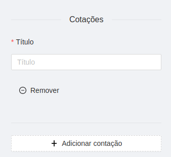

# Descrição
Pedro, é um programador front-end e está com um problema no desenvolvimento de uma interface. Ele deve criar um formulário que possui itens que são adicionados de forma dinâmica com um botão. Pedro vai estilizar e criar os elementos por conta própria mas ele precisa da sua ajuda para construir essa funcionalidade.

# Funcionalidades
- Adicionar cotação
- Remover cotação
- Alterar o título de uma das contações

Utilize a linguagem que mais lhe for conveniente.
Obs. Não é necessário o desenvolvimento da interface, apenas da funcionalidade.