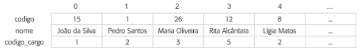

# Descrição
Uma empresa do ramo da construção civil está informatizando seu Departamento de Pessoal. Inicialmente, cadastrou o salário de todos os cargos da empresa em um vetor de cargos. Cada tipo de cargo ocupa uma posição do vetor com o valor do salário.

Depois, cadastrou todos os seus funcionários em um vetor de funcionarios, contendo os seguintes campos: código, nome e código do cargo.

Crie uma aplicação com as seguintes funcionalidades:
1. Cadastrar cargo.
2. Cadastrar funcionário.
3. Mostrar um relatório contendo o código do funcionário, o nome e o valor do salário de cada funcionário.
4. Mostrar o valor total pago de salário aos funcionários que pertençam a um cargo informado pelo usuário.

# Informações adicionais
O código de um cargo é a posição dele no vetor de cargos.

## Funcionalidade 1 (Cadastrar cargo)
O sistema deve adicionar um novo cargo ao vetor de cargos.

## Funcionalidade 2 (Cadastrar funcionário)
- O sistema deve adicionar um novo funcionário ao vetor de funcionários.
- O sistema não deve permitir o cadastro de um funcionário com um código de funcionário repetido. 
- O sistema só deve permitir que o usuário escolha o código de um cargo que exista. Ex: se existem 5 cargos, o usuário só pode cadastrar valores de 0 à 4.

## Funcionalidade 3 (Mostrar relatório)
O sistema deve apenas listar as informações do vetor de funcionários.

## Funcionalidade 4 (Mostrar total de salário por cargo)
O sistema deve receber o código de um cargo (só deve aceitar código de cargos que existam) e somar o salário de todos os funcionários desse cargo.

### Observações
Não é necessário desenvolvimento da interface apenas as funcionalidades.
Utilize a linguagem que preferir
